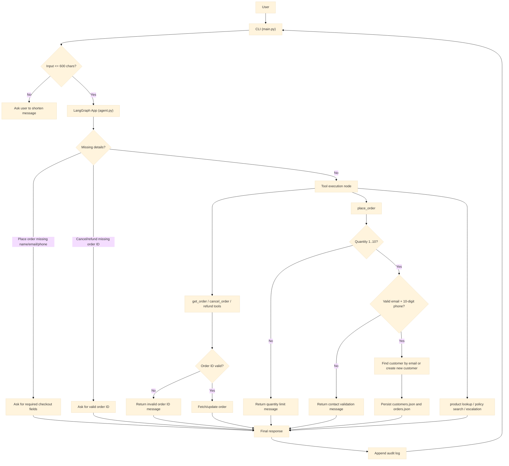

# ShopWave Architecture

## Notes

- Business rules are enforced in tools, not only by prompt instructions.
- Checkout requires full name, valid email, and exactly 10-digit phone.
- New customers are created when email is not found; existing customers are updated.
